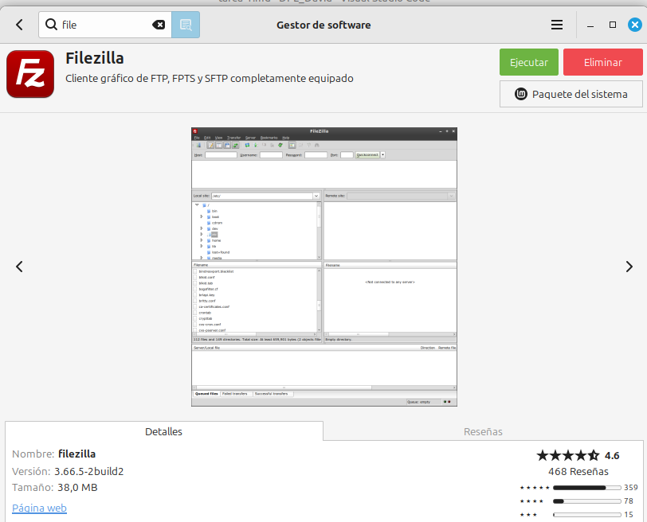

# Alojar en Infinity Free

El primer paso es descargar FileZilla 

Entras a tu account de infinity free

le das a panel de control

Entras en ftp accounts para ver los datos que tienes que introducir en filezilla

Estos son los datos

Rellenas estos campos y le das a conexion rapida

Una vez conectado te sale la carpeta htdocs y metes tus archivos de html dentro

