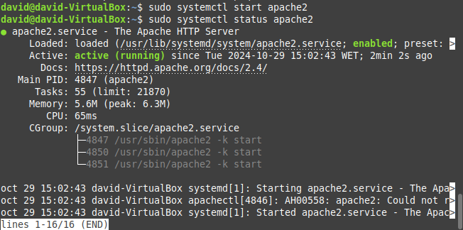
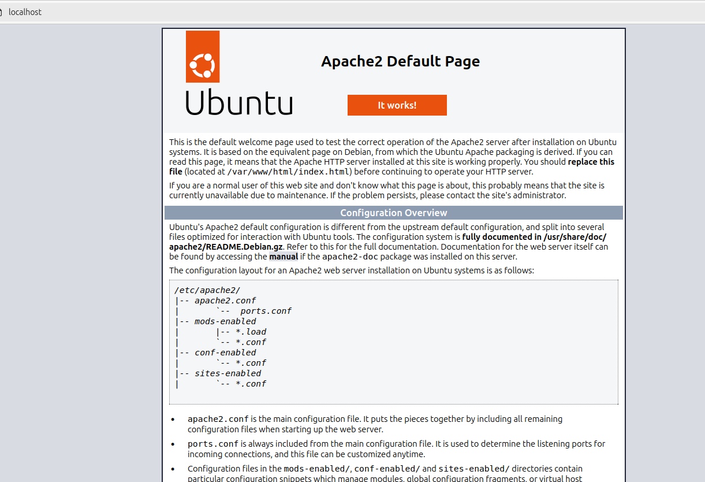
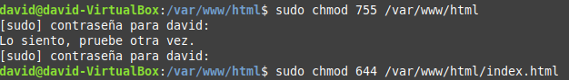
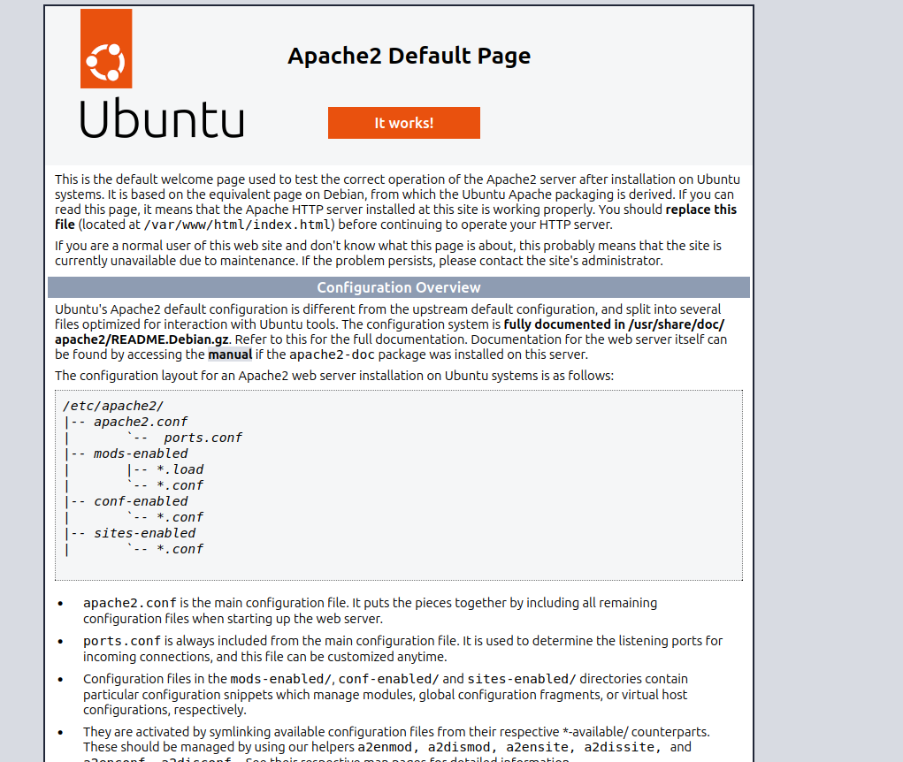

# Instalar Apache

Actualizamos los repositorios 

Instalamos el servidor Apache

Verificamos el estado del servicio

Entramos al localhost 

Cambiamos los permisos de las carpetas

 

# Instalar Tomcat

