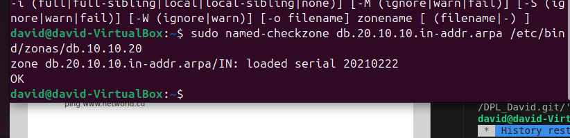
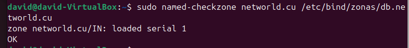

# Instalar DNS en Maquina Ubuntu

Lo primero es instalar bind9 con el comando sudo apt install bind9 y bind9 utils

hacemos sudo ufw allow bind9

despues hacemos sudo nano /etc/bind/named.conf.options
y añadimos esto 
```bash
        listen-on { any; };
        allow-query { localhost; 10.10.20.0/24; };
        forwarders {
                8.8.8.8;
                8.8.4.4;
};
};
```
Despues modificamos  sudo nano /etc/default/named y ponemos OPTIONS="-u bind -4"


despues hacemos 
sudo named-checkconf
sudo systemctl restart bind9
systemctl status bind9

en ```sudo nano /etc/bind/named.conf.local```

```bash
zone "networld.cu" IN {
        type master;
        file "/etc/bind/zonas/db.networld.cu";
};
zone "20.10.10.in-addr.arpa" IN {
        type master;
        file "/etc/bind/zonas/db.10.10.20";
};
```
creamos esta carpeta con sudo mkdir /etc/bind/zonas y en sudo nano /etc/bind/zonas/db.networld.cu agregamos esto 
``` bash
  GNU nano 7.2             /etc/bind/zonas/db.networld.cu                       
$TTL 1D
@   IN  SOA ns1.networld.cu. admin.networld.cu.(
        1       ; Serial
        12h     ; Refresh
        15m     ; Retry
        3w      ; Expire
        2h      ; Negative Cache TTÑ
)

@    IN  NS  ns1.networld.cu.
ns1 IN A 10.10.20.13
www IN A 10.10.20.13
@   IN A 10.0.2.15 
```
Y ahora en sudo nano /etc/bind/zonas/db.10.10.20
agregamos esto 
```bash
$TTL 1d ;
@   IN  SOA ns1.networld.cu. admin.networld.cu. (
        20210222 ; Serial
        12h      ; Refresh
        15m      ; Retry
        3w       ; Expire
        2h       ; Negative Cache TTL
)

; Registros NS
@   IN  NS  ns1.networld.cu.

; Registro PTR
1   IN  PTR www.networld.cu.
```

Para terminar hacemos 
sudo named-checkzone networld.cu /etc/bind/zonas/db.networld.cu
 
sudo named-checkzone db.20.10.10.in-addr.arpa /etc/bind/zonas/db.10.10.20 y nos tiene que dar 




y por ultimo hacemos el ping


