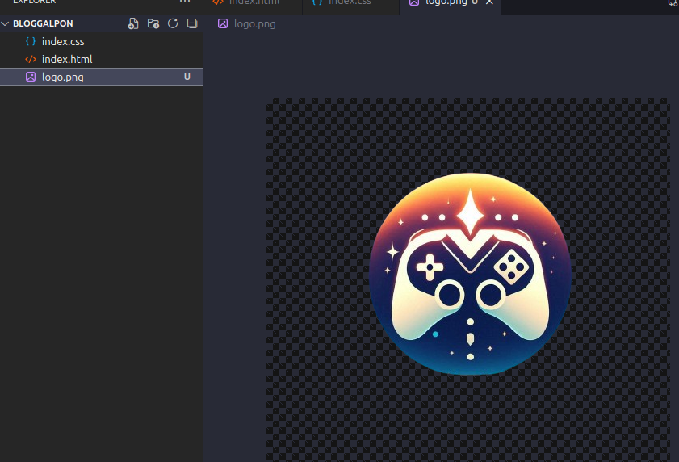

# TAREA GIT 1.3

Se crea el directorio con el repositorio

Se inicializa el repositorio

Se crea el HTML con la estructura basica

Se hace el commit con los cambios 

Se añade el contenido del header y se hace el commit

Se añade el contenido del body y se hace el commit

Se termina toda las estructura

Se añade el css

Se hace el commit

Se añade el logo

Se hace un tag

se crea y se entra en la rama desarrollo

se hace el merge de las ramas a master y se guardan los cambios

se crea otro tag 

