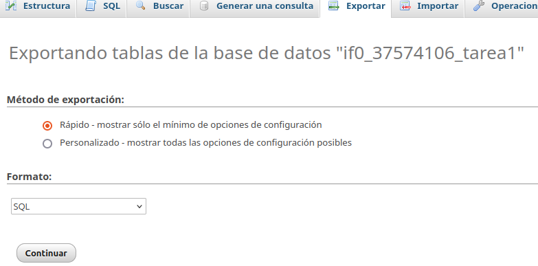
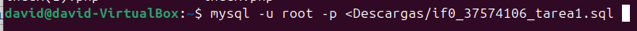
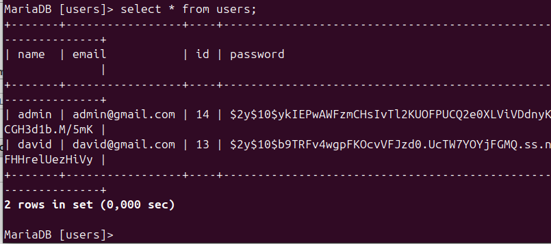
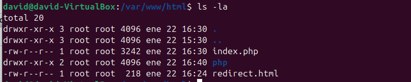
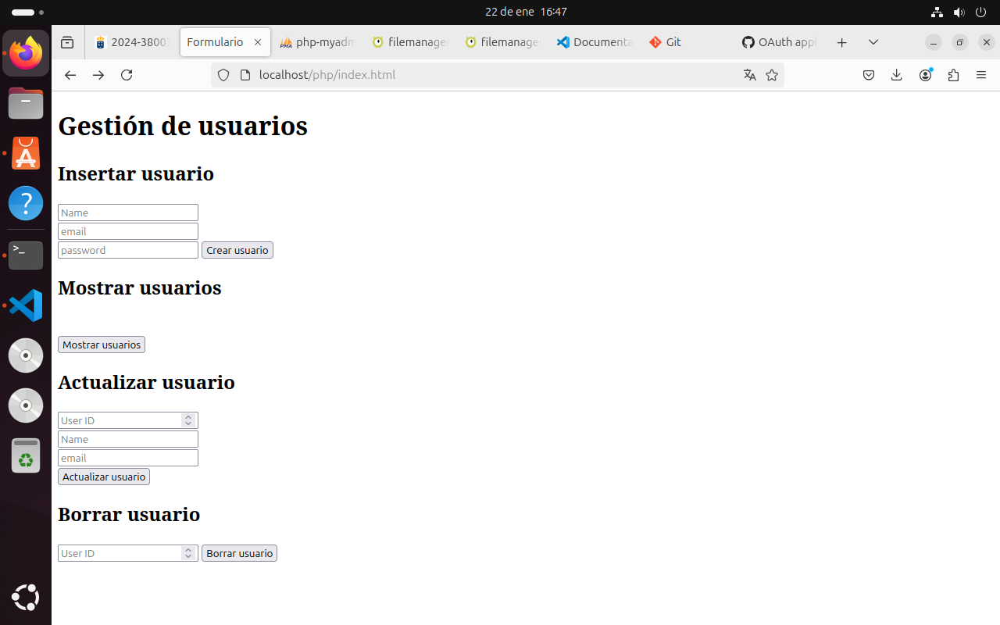

# Pasar archivos de Xaamp A Lamp 


```En primer lugar hay que tener instalado apache y todo lo hecho en la practica anterior```

Hay que exportar la base de datos de phpmyadmin
<p align="center"><p/>
<p align="center"><p/>
<p align="center"><p/>

Despues hay que meter en la carpeta ```/var/www/html/``` todos los archivos que teniamos en la pagina de xaamp para migralos.

<p align="center"><p/>

Por ultimo nos metemos a localhost para comprobar que todo ha funcionado

<p align="center"><p/>


