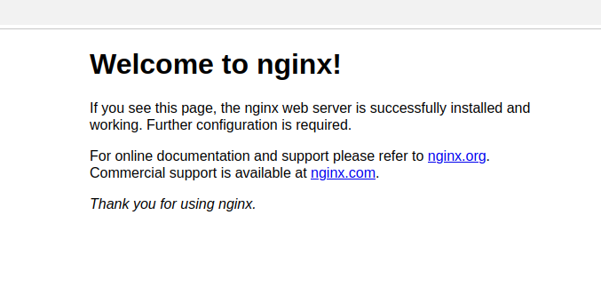

# Instalación de Nginx

Para instalar Nginx, utilice el siguiente comando:

```
sudo apt update
sudo apt install nginx
```

Después de instalarlo, ya tienes todo lo que necesitas.

Puedes escribir localhost en el navegador y te saldra la pagina de inicio de nginx



Si usted ve esta página, ha instalado Nginx con éxito en su web server.
