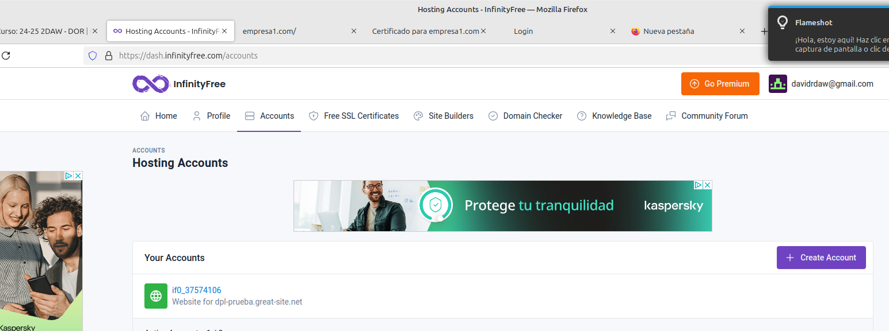
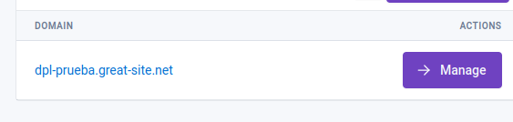
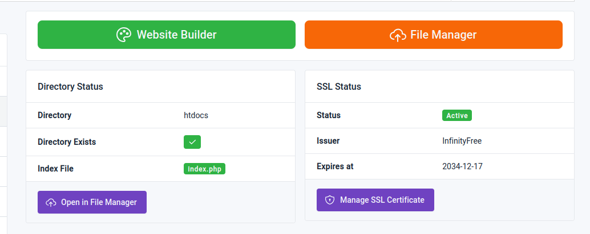
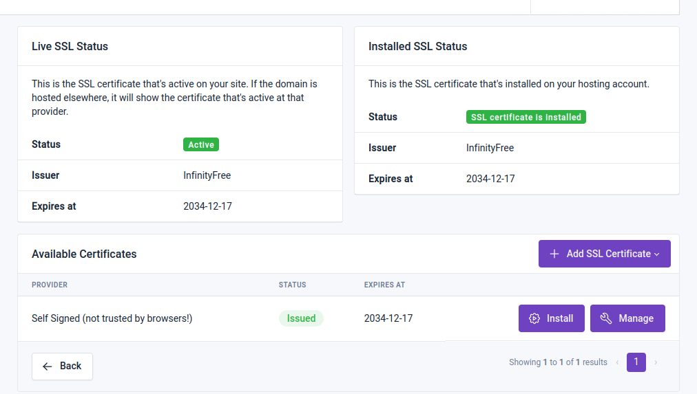
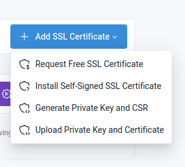
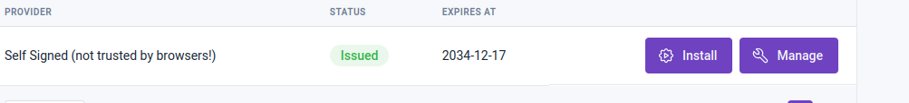

# INSTALAR SSL EN INFINITY FREE

Nos logeamos en infinity free y accedemos a nuestra pagina creada anteriormente, le damos a manage 

Le damos a manage ssl certificate

Le damos a add certificate

Y a install self signed certificate

Por ultimo le damos a install y esperamos a que se active

Para comprobar si funciona entramos a https://<dominio-de-la-pagina>